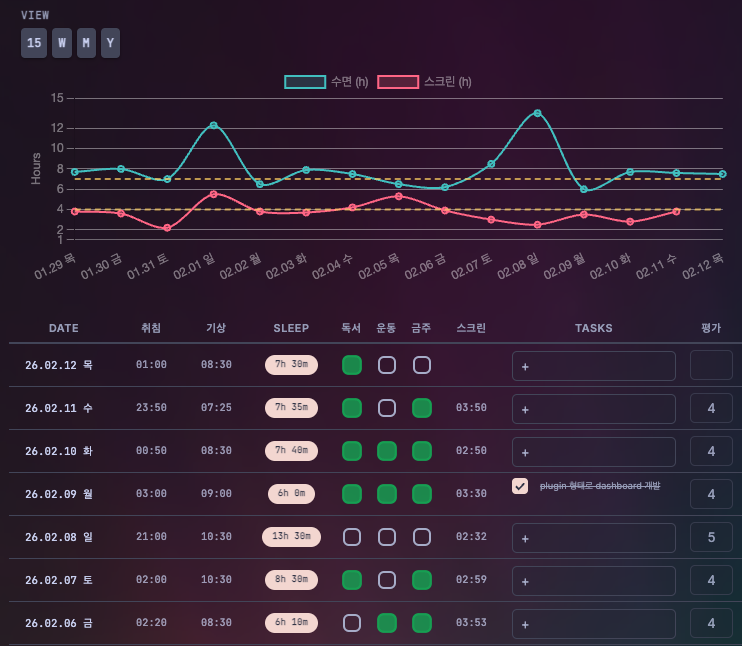

# Life Dashboard

Life Dashboard는 수면, 습관, 할 일, 일기 등 일상 데이터를 종합적이고 편집 가능한 테이블 뷰로 추적하고 시각화하는 옵시디언(Obsidian) 플러그인입니다.



## 주요 기능

- **일간 요약**: 최근 일상을 깔끔한 테이블 형식으로 모아봅니다.
- **수면 추적**: 취침 시간(`취침`)과 기상 시간(`기상`)을 입력하면 수면 시간을 자동으로 계산합니다.
- **습관 추적**: 운동, 독서, 금주 여부를 간단한 체크박스로 관리합니다.
- **할 일 및 일기 통합**: 개별 파일을 열지 않고 대시보드에서 `### Tasks` 및 `### Journal` 섹션을 직접 읽고 편집합니다.
- **인라인 편집**: 테이블 뷰에서 프론트매터 속성과 텍스트 섹션을 직접 수정합니다.
- **탐색**: 일간, 주간, 월간 노트 구조를 지원합니다.

---

## 사용 방법

### 1. 노트 구조
이 플러그인이 올바르게 작동하려면 데일리 노트에 특정 **프론트매터 속성**과 **마크다운 헤더**가 필요합니다.

#### 프론트매터 (YAML)
현재 플러그인은 데이터 매핑을 위해 다음 키(한글)를 사용합니다:

```yaml
---
취침: "23:30"       # 취침 시간 (HH:mm)
기상: "07:00"       # 기상 시간 (HH:mm)
스크린타임: "04:00"  # 스크린 타임 (HH:mm 또는 분 단위)
운동: true          # 운동 여부 (boolean)
독서: false         # 독서 여부 (boolean)
금주: true          # 금주 여부 (boolean)
평가: 8             # 하루 평가 (0-10)
---
```

### 본문 콘텐츠
플러그인은 Tasks 및 Journal 열을 위해 특정 헤더 아래의 콘텐츠를 파싱합니다:


```
### Tasks
- [ ] 프로젝트 완료하기
- [ ] 장보기

### Journal
오늘은 생산적인 하루였다...
```
### 2. 설정
설정(Settings) > Life Dashboard로 이동하여 보관소(Vault) 경로를 설정하세요:

일간/주간/월간 노트 폴더(Daily/Weekly/Monthly Notes Folder): 노트가 저장된 폴더 경로를 지정합니다.

날짜 형식(Date Formats): Moment.js 구문을 사용하여 파일 이름 형식을 설정합니다 (예: YYYY-MM-DD ddd).

### 설치 방법
커뮤니티 플러그인에서 설치 (출시 예정)
설정(Settings) > **커뮤니티 플러그인(Community Plugins)**을 엽니다.

**제한 모드(Restricted mode)**를 끕니다.

**탐색(Browse)**을 클릭하고 "Life Dashboard"를 검색합니다.

**설치(Install)**를 클릭한 후 **활성화(Enable)**를 누릅니다.

### 수동 설치
GitHub Releases 페이지에서 최신 릴리스 파일을 다운로드합니다.

다운로드한 파일(`main.js`, `manifest.json`, `styles.css`)을 보관소의 플러그인 폴더에 압축 해제하여 넣습니다: <VaultFolder>`/.obsidian/plugins/life-dashboard/`

옵시디언을 다시 로드합니다.


### 라이선스
MIT